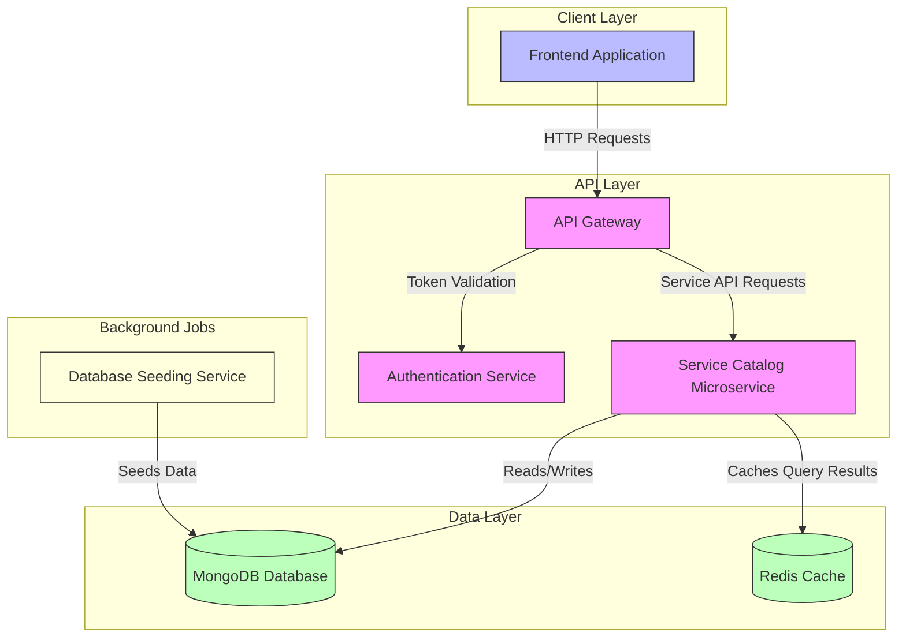
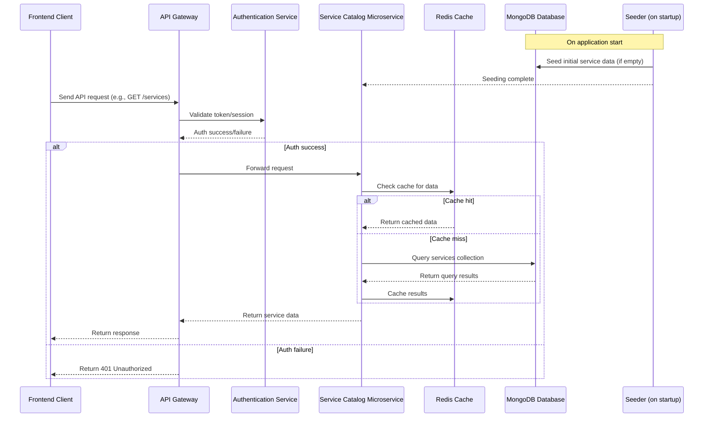
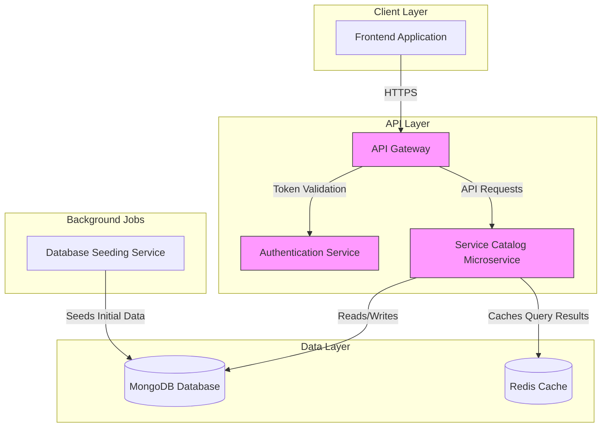

# fm-service

**FM-Service** application is a **Services Management API** built with Node.js, Express, MongoDB, and Redis caching. It provides a RESTful interface to create, read, update, delete, and query business service offerings. Each service has attributes such as name, description, category, industry, price, duration, and tags. The API is built with Node.js, Express, MongoDB (Mongoose), and Redis caching.

### Core Functions:

- Manage service catalog with CRUD operations.
- Support filtering and pagination on service listings.
- Ensure data integrity with schema validation.
- Improve performance with Redis caching.
- Seed initial data for development/testing.

### Role as a Microservice

In a microservices architecture, this application acts as the **Service Catalog Microservice** responsible for managing the metadata and details of business services offered by the organization. Its purpose includes:

- Providing a centralized service registry for other systems (e.g., frontend UIs, billing, analytics).
- Decoupling service management from other business domains such as user management, orders, or payments.
- Enabling scalability and independent deployment of the service management functionality.
- Serving as a single source of truth for service definitions and pricing.

### Purpose in Overall Architecture

This microservice typically integrates with:

- **API Gateway:** Routes client requests to this service.
- **Authentication Service:** Secures access to service management endpoints.
- **Frontend Applications:** Fetch service listings and details for display.
- **Order/Booking Microservices:** Query available services to create orders.
- **Analytics/Reporting Services:** Analyze service usage and pricing trends.
- **Database and Cache:** MongoDB stores persistent service data; Redis caches frequent queries.

## System Architecture Diagram



### Explanation

- Frontend Application sends HTTP requests to the API Gateway.
- API Gateway authenticates requests via Authentication Service and routes service-related requests to the Service Catalog Microservice.
- The Service Catalog Microservice handles CRUD operations on services, backed by MongoDB for persistence.
- It uses Redis Cache to cache frequent queries and improve response times.
- A Database Seeding Service runs on startup to populate MongoDB with initial service data.
  This architecture supports scalability, separation of concerns, and performance optimization.

---

## Table of Contents

- [Architecture & Technologies](#architecture--technologies)
- [Environment Configuration](#environment-configuration)
- [Data Model](#data-model)
- [API Endpoints](#api-endpoints)
- [Middleware & Security](#middleware--security)
- [Caching Layer](#caching-layer)
- [Seeding Data](#seeding-data)
- [Error Handling](#error-handling)
- [Usage & Pagination](#usage--pagination)
- [Unit Test Coverage](#unit-test-coverage)
- [CI/CD Pipeline](#cicdpipeline)
- [Database Indexing](#database-indexing)

---

## Architecture & Technologies

- **Node.js** with **Express** for HTTP server and routing.
- **MongoDB** as the primary database, accessed via **Mongoose** ODM.
- **Redis** for caching query results to improve performance.
- **Faker.js** for generating seed data.
- Middleware includes:
  - `cors` for Cross-Origin Resource Sharing.
  - `helmet` for security headers.
  - `morgan` for HTTP request logging.
  - `cookie-parser` for cookie handling.

---

## Environment Configuration

The application uses environment variables managed via `.env` file and `dotenv` package:

| Variable         | Description                                   |
| ---------------- | --------------------------------------------- |
| `PORT`           | Port number for Express server.               |
| `MONGO_URL`      | MongoDB connection string (production).       |
| `MONGO_URL_TEST` | MongoDB connection string (test environment). |
| `REDIS_URL`      | Redis connection string.                      |
| `CORS_ORIGINS`   | Comma-separated list of allowed CORS origins. |

---

## Data Model

### Service Schema

| Field            | Type     | Description                                | Constraints / Notes                                                                               |
| ---------------- | -------- | ------------------------------------------ | ------------------------------------------------------------------------------------------------- |
| `name`           | String   | Unique name of the service.                | Required, unique, trimmed                                                                         |
| `description`    | String   | Detailed description of the service.       | Required                                                                                          |
| `category`       | String   | High-level classification of the service.  | Enum: `Financial Analysis`, `Marketing Analytics`, `Business Intelligence`, `Consulting Services` |
| `industry`       | String   | Target industry vertical.                  | Enum: `Retail`, `E-commerce`, `Healthcare`, `Manufacturing`                                       |
| `price`          | Number   | Price in currency units.                   | Required, minimum 0                                                                               |
| `duration_hours` | Number   | Time required to deliver the service.      | Enum: 1, 2, 4, 8, 12                                                                              |
| `tags`           | [String] | Keywords/tags associated with the service. | Optional, default empty array                                                                     |
| `createdAt`      | Date     | Timestamp of creation.                     | Auto-generated                                                                                    |
| `updatedAt`      | Date     | Timestamp of last update.                  | Auto-generated                                                                                    |

---

## API Endpoints & Documentation

- Docs: `/api-docs`

All endpoints are prefixed with `/api/services`.

### 1. Get Services (List with Pagination & Filtering)

- **URL:** `/api/services`
- **Method:** `GET`
- **Query Parameters:**
  - `page` (optional, default: 1) — Page number for pagination.
  - `limit` (optional, default: 9) — Number of services per page.
  - Other query parameters for filtering (e.g., `category`, `industry`, `tags`) can be passed as MongoDB query filters.
- **Response:**
  ```json
  {
    "data": [
      /* Array of service objects */
    ],
    "total": 275,
    "page": 1,
    "limit": 9,
    "totalPages": 31
  }
  ```
- **Description:** Returns paginated list of services matching optional filters.

---

### 2. Get Service by ID

- **URL:** `/api/services/:id`
- **Method:** `GET`
- **URL Params:**
  - `id` — Service MongoDB ObjectId.
- **Response:**
  ```json
  {
    "_id": "60f7c0f5b7e6a4567890abcd",
    "name": "Financial Analysis for Retail - Profitability Optimization",
    "description": "...",
    "category": "Financial Analysis",
    "industry": "Retail",
    "price": 50000,
    "duration_hours": 8,
    "tags": ["forecasting", "ROI"],
    "createdAt": "...",
    "updatedAt": "..."
  }
  ```
- **Description:** Retrieves a single service by its unique ID.

---

### 3. Create a New Service

- **URL:** `/api/services`
- **Method:** `POST`
- **Request Body:**
  ```json
  {
    "name": "Marketing Analytics for E-commerce - Customer Segmentation",
    "description": "Detailed description...",
    "category": "Marketing Analytics",
    "industry": "E-commerce",
    "price": 30000,
    "duration_hours": 4,
    "tags": ["data-driven", "strategy"]
  }
  ```
- **Response:** Newly created service object with `_id` and timestamps.
- **Description:** Creates a new service record. Name must be unique.

---

### 4. Update an Existing Service

- **URL:** `/api/services/:id`
- **Method:** `PUT`
- **URL Params:**
  - `id` — Service MongoDB ObjectId.
- **Request Body:** Partial or full service object fields to update.
- **Response:** Updated service object.
- **Description:** Updates fields of an existing service by ID.

---

### 5. Delete a Service

- **URL:** `/api/services/:id`
- **Method:** `DELETE`
- **URL Params:**
  - `id` — Service MongoDB ObjectId.
- **Response:** Deleted service object or confirmation.
- **Description:** Deletes a service by its ID.

---

## Middleware & Security

- **CORS:** Configured to allow origins specified in `CORS_ORIGINS` environment variable.
- **Helmet:** Adds security headers to all responses.
- **Logging:** HTTP requests logged with `morgan` in development mode.
- **Body Parsing:** Supports JSON and URL-encoded payloads.
- **Cookie Parsing:** Supports cookie handling.

---

## Caching Layer

- **Redis** is used to cache results of service queries.
- Read methods (`findServices`, `findServiceById`) cache results for 60 seconds.
- Write methods (`createService`, `updateService`, `deleteService`) flush Redis cache to maintain consistency.
- Cache keys are generated based on method name and arguments.

---

## Seeding Data

- On database connection, the system seeds 275 unique service records if none exist.
- Uses Faker.js to generate realistic service names, descriptions, prices, and tags.
- Ensures uniqueness of service names.
- Categories and industries are chosen from predefined enums.

---

## Error Handling

- 404 errors for unknown routes return JSON with message.
- Other errors return JSON with `message` and stack trace in development mode.
- Status codes reflect the nature of the error (e.g., 400 for bad request, 404 for not found, 500 for server errors).

---

## Usage & Pagination Notes

- Pagination defaults to 9 items per page.
- Clients can specify `page` and `limit` query parameters.
- Total pages and total item count are included in the response for UI navigation.
- Filtering can be done by passing query parameters matching service fields (e.g., `category=Financial Analysis`).

---

## Unit Test Coverage

This project includes unit tests covering the critical functionality of the Services API. The tests verify that the REST endpoints behave as expected under normal conditions, ensuring the reliability and stability of the application.

## Purpose of Unit Tests

- Verify that each API endpoint behaves correctly under normal conditions.
- Ensure that the service layer methods are called correctly by the routes.
- Confirm that the API returns appropriate HTTP status codes and response bodies.
- Provide a safety net for future code changes by detecting regressions early.

## Scope of Tests

The unit tests cover the following critical API endpoints:

| HTTP Method | Endpoint            | Tested Scenarios                                                     |
| ----------- | ------------------- | -------------------------------------------------------------------- |
| GET         | `/api/services`     | Returns paginated list of services                                   |
| GET         | `/api/services/:id` | Returns a service by ID; handles not found and invalid ID cases      |
| POST        | `/api/services`     | Creates a new service; handles validation errors                     |
| PUT         | `/api/services/:id` | Updates an existing service; handles not found and validation errors |
| DELETE      | `/api/services/:id` | Deletes a service; handles not found and errors                      |

---

## Test Implementation Details

### Test Frameworks and Libraries

- **Mocha:** Test runner.
- **Chai:** Assertion library.
- **Supertest:** HTTP assertions for Express endpoints.
- **Sinon:** Stubs and mocks for isolating service layer methods.

### Test Isolation

- The service layer (`serviceService`) methods are stubbed using Sinon to isolate route tests from database and Redis cache.
- This ensures tests run quickly and deterministically without external dependencies.

### Test Structure

- **Setup:** Before each test, stub relevant service methods.
- **Teardown:** Restore stubs after each test to avoid side effects.
- **Assertions:** Verify HTTP status codes, response bodies, and that service methods are called with expected arguments.

---

## Example Test Case Descriptions

### 1. GET `/api/services`

- **Purpose:** Verify that a paginated list of services is returned correctly.
- **Test:** Stub `findServices` to return a fake paginated result; assert response status 200 and correct JSON body.

### 2. GET `/api/services/:id`

- **Purpose:** Verify retrieval of a single service by ID.
- **Tests:**
  - Service found: returns 200 with service data.
  - Service not found: returns 404 with error message.
  - Invalid ID format: returns 400 with error message.

### 3. POST `/api/services`ƒ

- **Purpose:** Verify creation of a new service.
- **Tests:**
  - Valid data: returns 201 with created service.
  - Validation error: returns 400 with error message.

### 4. PUT `/api/services/:id`

- **Purpose:** Verify update of an existing service.
- **Tests:**
  - Service updated: returns 200 with updated service.
  - Service not found: returns 404 with error message.
  - Validation error: returns 400 with error message.

### 5. DELETE `/api/services/:id`

- **Purpose:** Verify deletion of a service.
- **Tests:**
  - Service deleted: returns 204 No Content.
  - Service not found: returns 404 with error message.
  - Delete error: returns 400 with error message.

---

## Running the Tests

- Run tests with:

  ```bash
  yarn cache clean
  yarn test
  ```

- Tests are located in `test/services.test.js`.
- Tests execute quickly due to stubbing and do not require a live database or Redis instance.

---

# Appendix

## Example cURL Requests

### List services (page 1, limit 5)

```bash
curl "http://localhost:3000/api/services?page=1&limit=5"
```

### Get a single service

```bash
curl "http://localhost:3000/api/services/60f7c0f5b7e6a4567890abcd"
```

### Create a service

```bash
curl -X POST "http://localhost:3000/api/services" \
  -H "Content-Type: application/json" \
  -d '{
    "name": "Consulting Services for Healthcare - Efficiency Improvement",
    "description": "Comprehensive consulting service...",
    "category": "Consulting Services",
    "industry": "Healthcare",
    "price": 45000,
    "duration_hours": 8,
    "tags": ["optimization", "growth"]
  }'
```

### Sequence Diagram



### Explanation

This diagram shows the typical flow when a client requests service data, including authentication, caching, database access, and seeding on startup. It illustrates the request lifecycle including authentication, cache lookup, DB query, and response.

### Deployment Diagram



### Explanation

- This diagram shows the deployment environment components and how they interact. It shows the microservice components, data stores, and client interaction points.
- The Seeder runs once on startup to populate MongoDB with initial data.
- Redis cache improves performance by storing frequently requested service data.

## CI/CD Pipeline

This document outlines the Continuous Integration (CI) and Continuous Deployment (CD) pipeline implemented for the Node.js/Express application using GitHub Actions. The pipeline automates the process of testing code changes and deploying the application to Render upon successful validation.

Overview
The pipeline is triggered by pushes to the main branch and by pull requests targeting main. It consists of two main jobs:

Test Job: Sets up a Node.js environment, installs dependencies, and executes the unit test suite.

Deploy Job: Runs only if the Test Job passes successfully and the push is to the main branch. It triggers a new deployment of the application on Render.

Key Components & Technologies
GitHub Actions: The automation platform used to define and execute the CI/CD workflow.

Node.js 22.12: The specified Node.js version for the build environment.

Yarn: The package manager used for installing dependencies.

mocha & chai: The testing framework and assertion library used for writing unit tests.

supertest: Used for testing HTTP endpoints by making requests to the Express application.

sinon: Used for mocking and stubbing external dependencies (like the serviceService and the Redis client) to ensure tests run in isolation.

In-Memory MongoDB (mongodb-memory-server): The utils/db.js module is configured to dynamically start an in-memory MongoDB instance for tests, eliminating the need for a real MongoDB server.

In-Memory Redis Mock (Custom): The utils/cache.js module is configured to use a custom, in-memory mock for the node-redis client when in test mode. This prevents actual network connections to Redis.

Environment Variable (NODE_ENV): The NODE_ENV environment variable is set to “test” in the GitHub Actions workflow to activate conditional logic in app.js, utils/db.js, and utils/cache.js for test-specific configurations.

Render Deploy Hook: Used by GitHub Actions to trigger deployments.

RENDER_DEPLOY_HOOK_URL_NODE (GitHub Secret): The unique deploy hook URL for the specific Render Node.js service, stored securely as a GitHub secret. This URL contains the necessary authentication token.

curl: A command-line tool used in the GitHub Actions workflow to make the HTTP POST request to Render’s deploy hook URL.

Workflow (.github/workflows/node-ci.yml)
The node-ci.yml file defines the complete CI/CD pipeline:

test Job:

Checkout code: Clones the repository.

Set up Node.js: Configures the Node.js environment and caches Yarn dependencies.

Install dependencies: Installs project dependencies from package.json using yarn install --frozen-lockfile.

Run unit tests: Executes yarn test.

deploy Job:

Dependencies: This job needs: test, meaning it will only start if the test job completes successfully.

Conditional Execution: It runs only if the test job was successful (if: success()) AND the push was to the main branch (github.ref == ‘refs/heads/main’). This prevents deployments from pull requests or other branches.

Checkout code: Clones the repository again (for the deploy job’s context).

Trigger Render Deployment:

Uses curl to send a POST request directly to the RENDER_DEPLOY_HOOK_URL_NODE.

The deploy hook URL handles authentication, so no separate Authorization header is required.

## Database Indexing

This app applies thoughtful indexing on the **`services`** collection to optimize API performance at scale.

#### Indexes applied:

| Fields                | Type          | Purpose                        |
| --------------------- | ------------- | ------------------------------ |
| `category`            | Single        | Fast filter by category        |
| `industry`            | Single        | Fast filter by industry        |
| `category + industry` | Composite     | Optimized for combined filters |
| `createdAt`           | Single (desc) | For sorting by newest services |

### Benefits:

- Faster paginated queries with filters
- Reduced load on MongoDB under high API traffic
- Support for future analytics/reporting

### Notes:

- These indexes align with API query patterns in `/services`.
- Additional indexes may be added as new features/queries are introduced.
